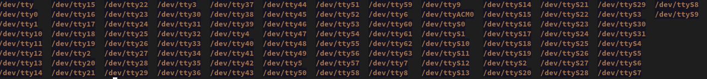
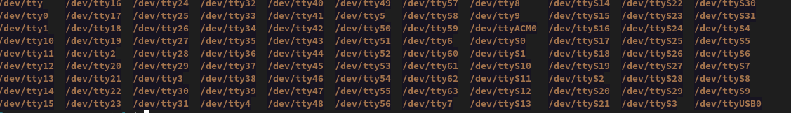

# WLED Printer Install

The intent of this guide is to provide a series of steps that can be followed to get up and running with a WiFi WLED\* board for use with Klipper.
This process can be completed without soldering as ESP32/ESP8266 boards can be purchased with pre-soldered headers, However if you have even basic soldering skills adding your own headers is pretty easy.

*This guide was written using a Windows device on a Windows laptop for a WiFI only WLED setup to ensure it's easy to follow for the widest range of users.*
*\* I'll be adding Serial instructions later for those who want to control the LED's over serial connection *

This is a living document, based on feedback things may change.
Many of the references found within are sourced from the official wled wiki along with resources taken from Moonraker, and richardjm's work on the macros & WLED integration.


This guide will get you running with 1-70 LED's without using an external power source, once you exceed this value you may notice a lack of power, or fade but more on that later.


## Requirements
### Must have

 - ESP8266 or ESP32 Style board
 - 5V shielded cable such as USB 2.0, or a twisted pair like ethernet work best as they are designed to reject sources of EMI (other options are may be fine in your implementation)
 - Relevant USB cable for setup
 - Computer with USB ports, and a recent version of the Chrome or Edge browser.
 - 5V LED Strip or Neo Pixels *i.e. WS281X or SK6812 RGBW*

### Optional
- Solder & Soldering Iron\*
- *flux is a nice to have*
- Crimping Tool (*needle nose pliers can be used, but its not ideal*)
- JST or Dupont connectors suitable for PCB mount (*directly soldering wires to the board is possible but not adivsed*)
- JST SH or Microfit connectors to simplifiy maintenence the LED strip (*this allows for a simple disconnect to be placed*)

### Recommended

Only links to items that have been tested are included in this section
There are no affiliate or tracking Links (screw that)

D1 Mini (clone's)
- [Win Win - Aliexpress](https://www.aliexpress.com/item/32651747570.html)
- [AZDelivery - Amazon UK](https://www.amazon.co.uk/AZDelivery-D1-Mini-Development-Compatible/dp/B0754N794H/)
**! Avoid ESP32-C RISK-V boards for now**

Shielded Cable / Twisted Pair

Shielded - [Amazon Basics USB 2.0 Cable 3M/10feet - UK](https://www.amazon.co.uk/gp/product/B00NH13DV2)
Twisted Pair -[Cat 5e](https://www.amazon.co.uk/Snagless-Ethernet-Network-Compatible-Consoles-Grey/dp/B08DCQMKTC/)


Connectors
- Cable connectors
  - JST SM (no link)
- PCB connectors
  - JST XH (no link) 

Crimping Tools
- IWISS IWS-2820M *or* ENGINEER PA-09 style 

Soldering Iron
- [PINECIL](https://pine64.com/product/pinecil-smart-mini-portable-soldering-iron/) - My personal preference 

Solder
- For this application 

Flux (optional)
- [MG Chemicals - Amazon UK](https://www.amazon.co.uk/MG-Chemicals-Pneumatic-Dispenser-Dispensing/dp/B00425FUW2)
- [MG Chemicals - Amazon US](https://www.amazon.com/MG-Chemicals-Pneumatic-Dispenser-Dispensing/dp/B00425FUW2)


Some tested/validated hardware reccomendations can be found linked in the [Recommended](#recommended) section.


## Hardware Setup

### Flashing Firmware
#### Web Flash (No Serial Support)
1. Connect your ESP board to PC via USB 
  - Identify the COM port 
    - [windows](#windows-com)
    - [linux](#windows-com)
  - Fixing Drivers [Fix Drivers](#driver-fix)

2. Visit - [https://install.wled.me/v2.htm](https://install.wled.me/v2.htm)  using Chrome or Edge 
 - Click Install - A pop up should appear to select your D1 Mini
 - Click ok and it should flash (if not you can try hitting the reset/boot button on the D1 Mini)

If there is no device OR the device has an error in Device Manager head to **[Fixing Drivers](#driver-fix)**
\* ESP32-C boards are not compatible at present
\*\* The USB cable can be used for power if using a limited number of LED's **OR** 

#### Instructions for the serial configuration

\<TBC\>


### Wiring the Board
**Verify the pinuot on your own board before wiring as these may vary between manufacturers/ board revisions**


Ground
VCC
Signal  \<explain ESP8266 and ESP32 diffs\>
### Wiring the LED Strip
Ground - GND
VCC - 5V (VCC)   \<explain how the power can be connected to either end, including in the middle and supply power to both sides\>
Signal - DI (D+,S) \<explain that SIGNAL MUST go into the DIN on IN end of the strip\>

### (Optional) Longer strips

For longer runs several methods of supplying more power can be used, however the simplest is to supply the 5V and GND from a dedicated PSU like the RS-5-25 from Meanwell.

## Software Setup
#### Moonraker 

[Moonraker](https://moonraker.readthedocs.io/en/latest/configuration/#wled)


#### Klipper Macros


## Printer Setup
###

###

###


##### Recommended

Only links to items that have been tested are included in this section
There are no affiliate or tracking Links (screw that)

D1 Mini (clone's)
- [Win Win - Aliexpress](https://www.aliexpress.com/item/32651747570.html)
- [AZDelivery - Amazon UK](https://www.amazon.co.uk/AZDelivery-D1-Mini-Development-Compatible/dp/B0754N794H/)

**! Avoid ESP32-C RISK-V boards for now**

Shielded Cable / Twisted Pair

Shielded - [Amazon Basics USB 2.0 Cable 3M/10feet - UK](https://www.amazon.co.uk/gp/product/B00NH13DV2)
Twisted Pair -[Cat 5e](https://www.amazon.co.uk/Snagless-Ethernet-Network-Compatible-Consoles-Grey/dp/B08DCQMKTC/)


Connectors
- Cable connectors
  - JST SM (no link)
- PCB connectors
  - JST XH (no link) 


Crimping Tools
- IWISS IWS-2820M *or* ENGINEER PA-09 style 

Soldering Iron
- [PINECIL](https://pine64.com/product/pinecil-smart-mini-portable-soldering-iron/) - My personal preference 

Solder
- For this application 

Flux (optional)
- [(MG Chemicals - Amazon UK](https://www.amazon.co.uk/MG-Chemicals-Pneumatic-Dispenser-Dispensing/dp/B00425FUW2)
- [MG Chemicals - Amazon US](https://www.amazon.com/MG-Chemicals-Pneumatic-Dispenser-Dispensing/dp/B00425FUW2)


#### Klipper Macros
*The table below will eventually contain links to macros*.

|M117 Keyword|Preset|Macro Link|
|---|---|---|
|off|-99|```x```|
|ready|45|```x```|
|busy|43|```x```|
|heating|15|```x```|
|leveling|40|```x```|
|homing|40|```x```|
|cleaning|40|```x```|
|meshing|40|```x```|
|calibrating z|40|```x```|
|printing|46|```x```|
|complete|42|```x```|

#### WLED Presets
*WLED presets can be found in the **[/scripts/presets.json](/scripts/presets.json)***.


## Acknowledgements

Aircoookie and the wled contributors for the excellent WLED firmware.
[WLED](https://github.com/Aircoookie/WLED/)
[kno.wled.ge](https://kno.wled.ge/) *awesome url!*

Arksine and the moonraker contributors for moonraker
[Moonraker](https://github.com/Arksine/moonraker)

Kevin O connor and the Klipper3d community for Klipper & Klippy
[Klipper](https://github.com/Klipper3d/klipper)

Richard for his excelent M117 macro, scripts and for bringing WLED integration to Moonraker
[richardjm](https://github.com/richardjm/)


##### Fixes
###### Windows COM
- Open Device Manager *(Win + X then press M)*
    - Expand the "Ports (COM & LPT)"
    - Remove the device
    - Reconnect the device
        - Whichever device was added is the ESP board

[return to flow](#web-flash-no-serial-support)


###### Linux COM

Disconnect the device
run: ```ls /dev/tty*```



Reconnect the device
run: ```ls /dev/tty*```



#### 2
Open your computer WIFI and connect to the WLED-AP network the ESP is now broadcasting.
 password is - wled1234

Once connected visit - http://4.3.2.1

Click the Cog and select WiFi Setup to add your home network.
Save

Connect to your home WiFi, and query your Router for the new IP (or try http://wled.local)

Spot the difference, thats your COM device.


[return to flow](#web-flash-no-serial-support)


##### Driver Fix
\<insert image\>
[CP2102 - square chip](https://www.silabs.com/developers/usb-to-uart-bridge-vcp-drivers)

\<insert image\>
[CH34x - rectangular chip](https://github.com/nodemcu/nodemcu-devkit/tree/master/Drivers)


Alternate method
Download > The lates Zadig from https://zadig.akeo.ie/ 
    - Install the libusb-win32 option
    - Retry the web install


[return to flow](#web-flash-no-serial-support)